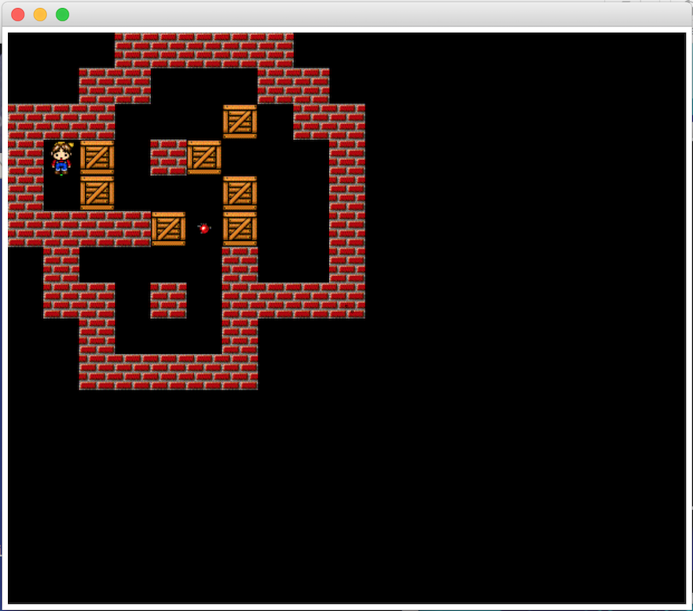
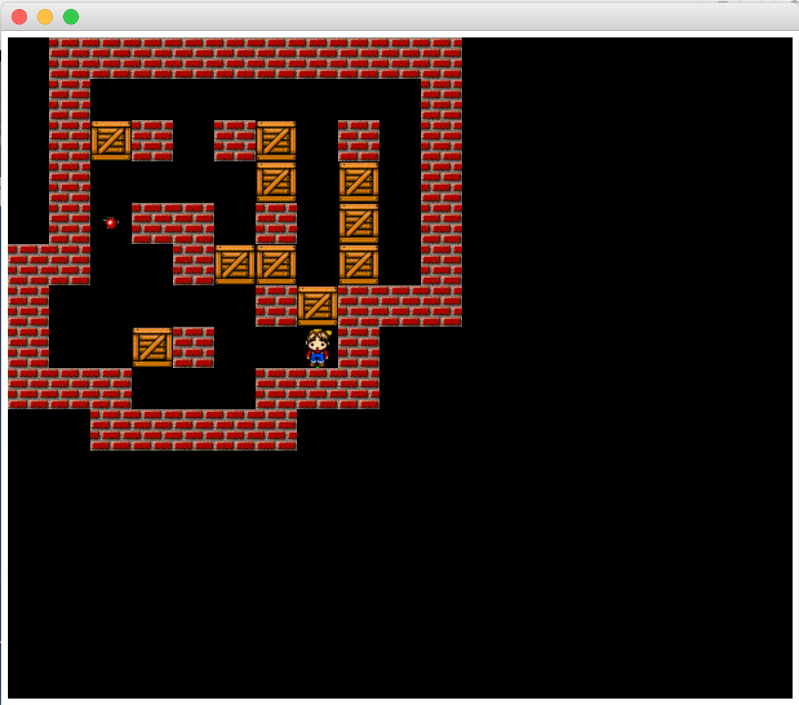
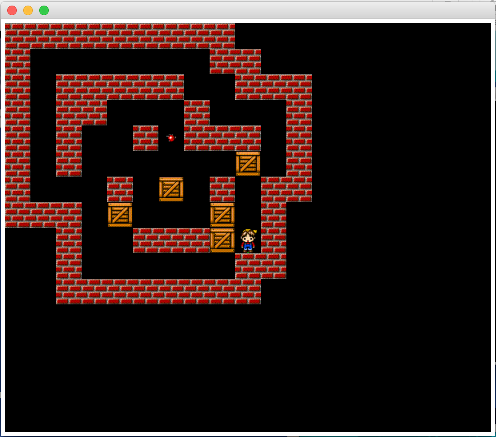

# Sokoban AI

## Description

A Sokoban AI implemented in Java using A* algorithm for solving levels of Sokoban game.

## Executable

Use the jar file to test the AI.

`java -jar SokobanNoUI.jar FILE_NAME N°HEURISTIC WEIGHTING_FOR_EACH_CASE
`

Example :   

` java -jar SokobanNoUI.jar ./niveaux/lvl26.sok 2 300
`

## Screenshots

